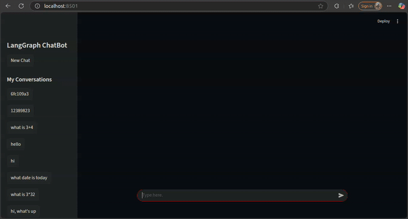

# LangGraph Multi-Tool RAG Agent

This project demonstrates a sophisticated, stateful conversational AI agent built with a powerful combination of LangGraph for the backend logic and Streamlit for the interactive user interface. The agent is capable of intelligently selecting from a diverse set of tools, including a **Retrieval-Augmented Generation (RAG)** pipeline for querying YouTube video transcripts, to answer complex user queries.

## ✨ Features

* **Conversational Memory**: The agent maintains a complete history of the conversation, allowing for context-aware follow-up questions. The state is durably persisted in a local SQLite database using `SqliteSaver`.
* **Multi-Tool Integration**: The agent can seamlessly access and use external tools to gather information or perform tasks that the language model alone cannot. The current toolset includes:
    * **🔎 Web Search**: Utilizes `DuckDuckGoSearchRun` to find up-to-date information on the internet.
    * **📈 Stock Price Checker**: Fetches the latest stock prices for a given symbol using the Alpha Vantage API.
    * **📊 Calculator**: Performs basic arithmetic operations such as addition, subtraction, multiplication, and division.
    * **📺 RAG for YouTube Transcripts**: Implements a full **Retrieval-Augmented Generation (RAG)** pipeline. It fetches a video transcript, creates a vector index using FAISS, retrieves relevant segments based on the user's query, and then provides this context to the LLM for a final answer.
* **Interactive Web UI**: A clean, user-friendly chat interface is provided using Streamlit, featuring robust conversation and session management that allows users to switch between different chat threads.
* **Efficient Caching**: The YouTube RAG tool intelligently caches transcript indexes to disk, using a hash of the content and configuration to avoid redundant processing for previously analyzed videos.

## 🏛️ Architecture

The application is logically separated into a backend, a frontend, and a modular toolset.

* **Backend (`langgraph_tools_backend.py`)**: The core of the agent. It uses **LangGraph** to construct a `StateGraph` that manages the conversation flow. The graph intelligently routes requests between the language model (`chat_node`) and the tool executor (`tool_node`) based on a `tools_condition`.
* **Frontend (`langgraph_tools_frontend.py`)**: The user interface is built with **Streamlit**. It manages user sessions and conversation threads, allowing users to start new chats or revisit previous ones from a sidebar. It streams the agent's responses in real-time and displays clear status updates when a tool is being used.
* **Tools (`youtube.py`, `calculator.py`, `get_stock_price.py`)**: Each tool is a self-contained Python function decorated with LangChain's `@tool` decorator. The `youtube.py` tool is a complete RAG pipeline for querying video content.

## 🚀 Getting Started

Follow these instructions to get the project running on your local machine.

### 1. Prerequisites

* An [OpenAI API key](https://platform.openai.com/api-keys)
* An [Alpha Vantage API key](https://www.alphavantage.co/support/#api-key) for the stock price tool

### 2. Installation and Setup

* Clone the repository to your local machine.
* Setup the virtual environment.
* Install requirements by running pip install -r requirements.txt
* Create a .env file and store the required api keys there.
